# Содержание
- [Журнал "Путевые листы"](#журнал-путевые-листы)
  - [Заполнение справочников](#заполнение-справочников)
    - ["Категории классности"](#--справочник-категории-классности)
    - ["Категории вредности"](#--справочник-категории-вредности)
    - ["Сотрудники"](#--справочник-сотрудники)
    - [Справочник "Виды ГСМ"](#--справочник-виды-гсм)
    - [Справочник "Категории дорог"](#--справочник-категории-дорог)
    - [Справочник "Страны"](#--справочник-страны)
    - [Справочник "Виды расчетов"](#--справочник-виды-расчетов)
    - [Справочник "Виды работ транспорта"](#--справочник-виды-работ-транспорта)
    - [Справочник "Виды работ"](#--справочник-виды-работ)
    - [Справочник "Способ расчета"](#--справочник-способ-расчета)
    - ["Транспортные средства"](#--справочник-транспортные-средства)
    - ["Марки автомобилей"](#--справочник-марки-автомобилей)
  - [Заполнение документов](#заполнение-документов)
    - [Документ "Установка расценок на работы"](#--документ-установка-расценок-на-работы)
    - [Документ "Установка норм расхода топлива на автомобили"](#--документ-установка-норм-расхода-топлива-на-автомобили)
    - [Документ "Ввод начальных показателей"](#--документ-ввод-начальных-показателей)
    - [Документ "Ремонт транспорта"](#--документ-ремонт-транспорта)
    - [""]()
    - [""]()
    - [""]()

# Журнал "Путевые листы"

 | Назначение  журнала |  Журнал  предназначен для хранения документов по учету и отражению информации о движении средств и затратах, связанных с путевыми листами  |
 |:-------------------------|:-------------------------------------------------------|
 | Путь                     |  Главное меню → Документы → Путевые листы |

Журнал выглядит следующим образом: 

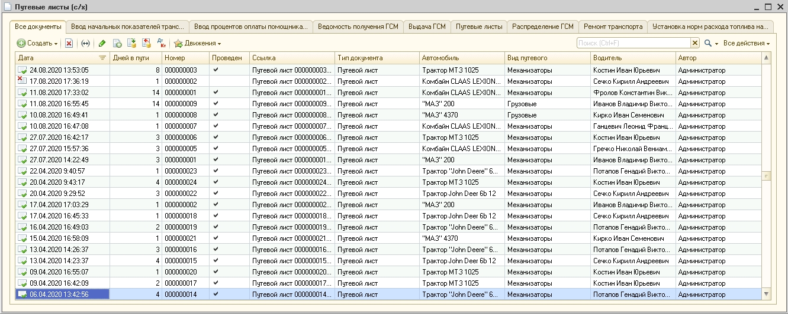

 

--------------------------------------------------------------------------------
-------------------------------------------------------------------------------- 

 

## Заполнение справочников

### &bull;  Справочник "Категории классности"
### &bull;  Справочник "Категории вредности"
### &bull;  Справочник "Сотрудники"
### &bull;  Справочник "Виды ГСМ"
### &bull;  Справочник "Категории дорог"
### &bull;  Справочник "Страны"
### &bull;  Справочник "Виды расчетов"
### &bull;  Справочник "Виды работ транспорта"
### &bull;  Справочник "Виды работ"

 | Назначение  справочника  |  Справочник предназначен предназначен для учета и хранения информации о различных видов работ   |
 |:-------------------------|:-------------------------------------------------------|
 | Путь                     |  Главное меню → Справочники → ???????? |

Форма списка справочника выглядит следующим образом:

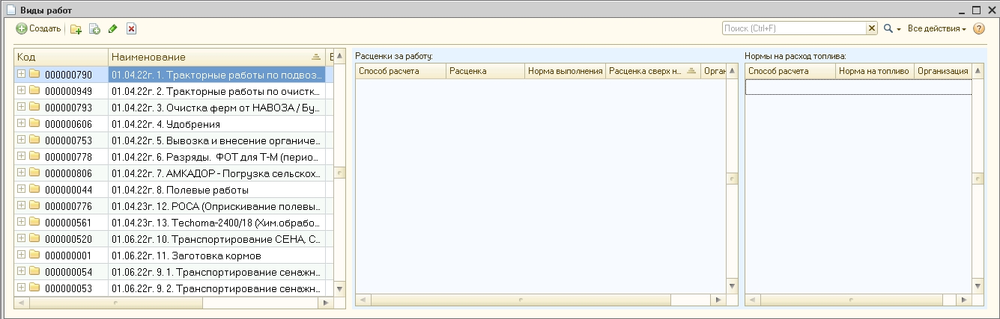

Чтобы добавить новый вид работ, нажмем "+" и заполним форму:

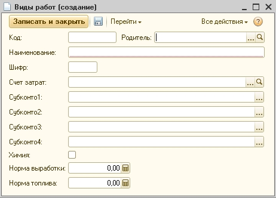

Далее нажимаем \"ок\" внизу формы.

Реквизиты для заполнения:

| **Реквизит**      |  **Содержание**                                          |
|:------------------|:---------------------------------------------------------|
| Код               | Номер элемента справочника в списке. Устанавливается  автоматически, изменять значение обычно нет    необходимости. |
| Родитель         | Выбирается папка, где будет храниться данный вид работ    |
| Наименование      | Любое понятное название                    |
| Счет затрат      | Из плана счетов выбирается счет, на который будут приходиться затраты по данному виду работ                   |
| Субконто    | Вносится субконто                   |
| Флаг "Химия"     | Ставится, если ???????????????????                  |
| Норма выработки    | Вносится норма выработки при выполнении работ                 |
| Норма топлива    | Вносится норма на топливо при выполнении работ              |

 

### &bull;  Справочник "Способ расчета"

 | Назначение  справочника  |  Справочник предназначен для хранения различных способов расчета       |
 |:-------------------------|:-------------------------------------------------------|
 | Путь                     |  Главное меню → Справочники → ???????? |

Форма списка справочника выглядит следующим образом:

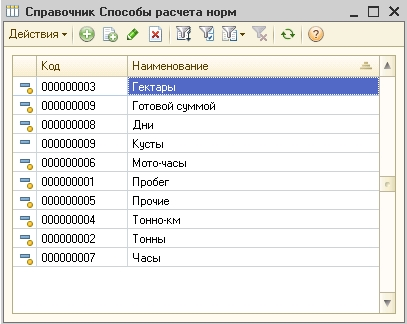

Чтобы добавить новый способ расчета, нажмем "+" и заполним форму:

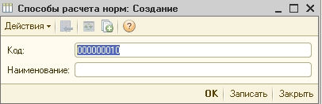
 
Далее нажимаем \"ок\" внизу формы.

Реквизиты для заполнения:

| **Реквизит**      |  **Содержание**                                          |
|:------------------|:---------------------------------------------------------|
| Код               | Номер элемента справочника в списке. Устанавливается  автоматически, изменять значение обычно нет    необходимости. |
| Наименование      | Любое понятное название                    |

 

### &bull;  Справочник "Транспортные средства"

 | Назначение  справочника  |  Справочник предназначен для хранения транспортных средств       |
 |:-------------------------|:-------------------------------------------------------|
 | Путь                     |  Главное меню → Справочники → ???????? |

Форма списка справочника выглядит следующим образом:

Чтобы добавить новое транспортное средство, нажмем "+" и заполним форму:

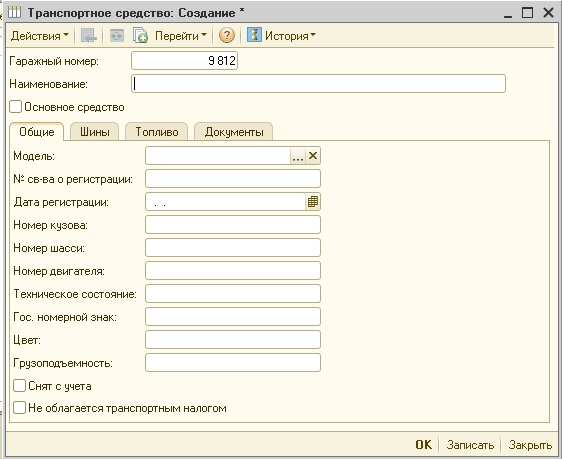

Далее нажимаем \"ок\" внизу формы.

Реквизиты для заполнения:

| **Реквизит**      |  **Содержание**                                          |
|:------------------|:---------------------------------------------------------|
| Гаражный номер               | Автоматически заполняется |
| Наименование      | Любое понятное название                    |
| Флаг "Основное средство"      | Отмечается, если нужно связать транспорт с основным средством. После этого выбтрается основное средство из справочника "Основные средства"            |
| Вкладка "Общие"                 |
| Модель   | Выбирается из справочника "Марки автомобилей"              |
| Флаг "Снят с учета"    | Отмечается, если транспортное средство снято с учета             |
| Флаг "Не облагается транспортным налогом"  | Отмечается, если не нужно облагать транспортным налогом             |

 

### &bull;  Справочник "Марки автомобилей"

| Назначение  справочника  |  Справочник предназначен для хранения марок автомобилей      |
 |:-------------------------|:-------------------------------------------------------|
 | Путь                     |  Главное меню → Справочники → ???????? |

Форма списка справочника выглядит следующим образом:

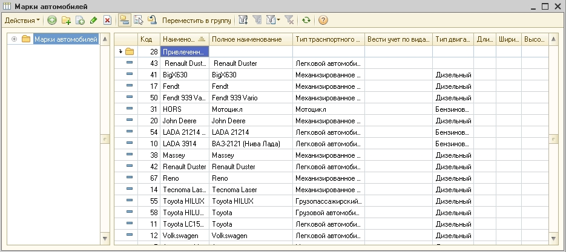

Чтобы добавить новое транспортное средство, нажмем "+" и заполним форму:

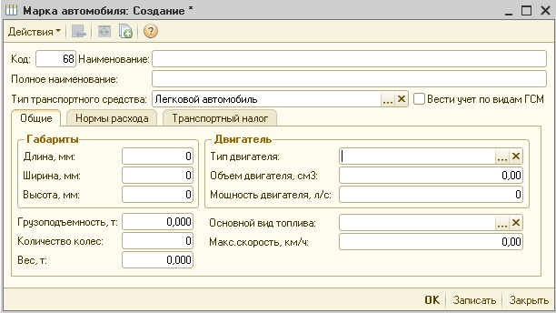

Далее нажимаем \"ок\" внизу формы.

Реквизиты для заполнения:

| **Реквизит**      |  **Содержание**                                          |
|:------------------|:---------------------------------------------------------|
| Код              | Автоматически заполняется |
| Наименование      | Любое понятное название                    |
| Полное наименование     | Отмечается, если нужно связать транспорт с основным средством. После этого выбтрается основное средство из справочника "Основные средства"            |
| Тип транспортного средства                |  Выбирается тип из списка:   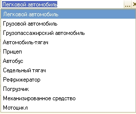  |
| Флаг "Вести учет по видам ГСМ"      | Ставится если необходим учет по видам ГСМ                |

 

--------------------------------------------------------------------------------
-------------------------------------------------------------------------------- 

 

## Заполнение документов

### &bull;  Документ "Установка расценок на работы"

| Назначение  документа  |  Документ предназначен для установки расценок на различные виды деятельности, норм на топливо и время работы определенны видов работ.     |
|:-------------------------|:-------------------------------------------------------|
| Путь                     |  Главное меню → Документы → ???????? |

Документ выглядит следующим образом:

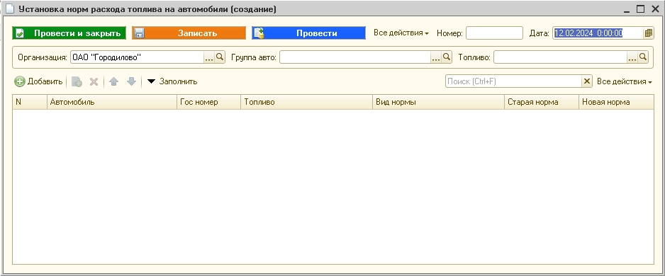

Заполняем документ. Далее нажимаем \"ок\" внизу формы.

Реквизиты для заполнения:

| **Реквизит**      |  **Содержание**                                          |
|:------------------|:---------------------------------------------------------|
| Номер              | Автоматически заполняется |
| Дата      | Любое понятное название                    |
| Организация     | Выбирается организация из списка заведенных в программе организаций         |
| Флаг "Вводить расценки сверхнормы по шкале" (опц)               |  ???????????|
| Группа видов работ (опц)  | Выбирается папка из справочника ["Виды работ"](#--справочник-виды-работ) . Если выбрать папку, то можно будет по кнопке "заполнить" заполнить таблицу всеми видами работ из данной папки             |
| Способ расчета (опц)  | Выбирается способ расчета из справочника ["Способы рассчета"](#--справочник-способ-расчета) , который будет автоматически заполняться в табличную часть при нажатии кнопки "Заполнить".|
| Табличная часть       |  |
| N  | Автоматическая нумерация элементов таблицы               |
| Вид работ  | Если табличная часть не заполнена автоматически по кнопке "заполнить" то выбирается из справочника "Виды работ"           |
| Способ расчета   |   Выбирается способ расчета из справочника ["Способы рассчета"](#--справочник-способ-расчета)            |
| Старая расценка (опц)  |    Заполняется автоматически старая расценка из выбранного вида работ           |
| Расценка за работу (опц) |   Устанавливается расценка за данный вид работ          |
| Норма выполнения (опц) |    Устанавливается норма на выполнение вида работ        |
| Расценка сверх нормы (опц)  |   Устанавливается расценка за работы, выполненные сверх нормы            |
| Способ расчета топлива (опц)  |  Выбирается способ расчета из справочника ["Способы рассчета"](#--справочник-способ-расчета)          |
| Норма на топливо (опц)  | Устанавливается норма на топливо при выполнении данного вида работ              |

### &bull;  Документ "Установка норм расхода топлива на автомобили"

| Назначение  документа  |  Документ предназначен для установки норм расхода топлива     |
|:-------------------------|:-------------------------------------------------------|
| Путь                     |  Главное меню → Документы → ???????? |

Документ выглядит следующим образом:

Заполняем документ. Далее нажимаем \"ок\" внизу формы.

Реквизиты для заполнения:

| **Реквизит**      |  **Содержание**                                          |
|:------------------|:---------------------------------------------------------|
| Номер              | Автоматически заполняется |
| Дата      | Любое понятное название                    |
| Организация     | Выбирается организация из списка заведенных в программе организаций         |
| Группа авто (опц)  |Выбираем из справочника ["Транспортные средства"](#--справочник-транспортные-средства). Необходим для фильтрации при автоматическом заполнении табличной части           |
| Топливо (опц)  |Выбирается из справочника ["Виды ГСМ"](#--справочник-виды-гсм). Необходим для фильтрации при автоматическом заполнении табличной части |
| Табличная часть       |  |
| N  | Автоматическая нумерация элементов таблицы               |
| Автомобиль  | Выбираем из справочника ["Транспортные средства"](#--справочник-транспортные-средства)         |
| Гос номер   |   Вводится номер. Если в транспортном средстве указан номер, то он заполнится автоматически            |
| Топливо  |    Выбирается из справочника ["Виды ГСМ"](#--справочник-виды-гсм). Если в транспортном средстве указано топливо, то он заполнится автоматически        |
| Вид нормы|   Устанавливается расценка за данный вид работ          |
| Старая норма |    Автоматически заполняется старая норма на выполнение вида работ, если она есть      |
| Новая норма |   Устанавливается норма на выполнение вида работ          |

### &bull;  Документ "Ввод начальных показателей"

| Назначение  документа  |  Документ предназначен для ввода начальных показателей километража, часов и ГСМ для автомобиля.   |
|:-------------------------|:-------------------------------------------------------|
| Путь                     |  Главное меню → Документы → ???????? |

Документ выглядит следующим образом:

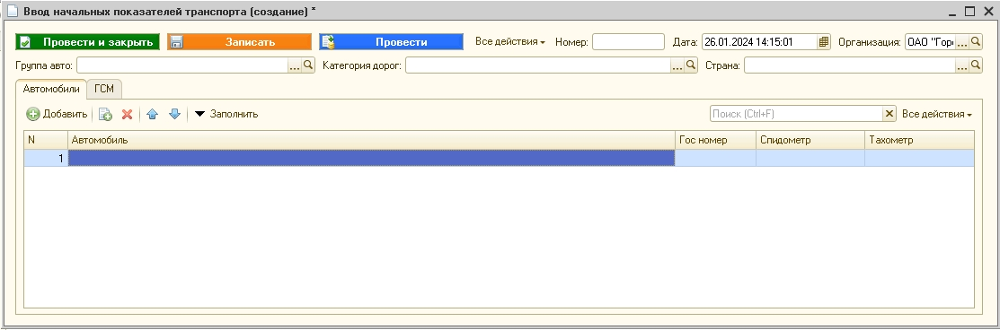

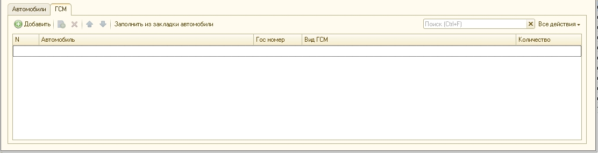

Заполняем документ. Далее нажимаем \"ок\" внизу формы.

Реквизиты для заполнения:

| **Реквизит**      |  **Содержание**                                          |
|:------------------|:---------------------------------------------------------|
| Номер              | Автоматически заполняется номер документа |
| Дата                | Автоматически устанавливается текущая дата, можно изменить при необходимости                    |
| Организация     | Выбирается организация из списка заведенных в программе организаций. При создании документа заполнена первая организация из списка        |
| Группа авто (опц)  | Выбирается папка из справочника ["Транспортные средства"](#--справочник-транспортные-средства). Если выбрать папку, то можно будет по кнопке "заполнить" заполнить таблицу всеми автомобилями из данной папки, иначе придется в табличной части добавлять каждый автомобить через кнопку "Добавить"           |
| Категория дорог (опц)  | Выбирается  из справочника ["Категории дорог"](#--справочник-категории-дорог)|
| Страна (опц)  | Выбирается  из справочника ["Страны"](#--справочник-страны)|
|  **Табличная часть "Автомобили"**        |
| Автомобиль | Выбирается  из справочника ["Транспортные средства"](#--справочник-транспортные-средства)|
| Гос. номер  | Вводится госномер, если в элементе справочника ["Транспортные средства"](#--справочник-транспортные-средства) номер указан, то заполнится автоматически|
| Спидометр | Вводятся начальные показатели спидометра|
| Тахометр  | Вводятся начальные показатели тахометра|
| **Табличная часть "ГСМ"**       |  |
| Автомобиль | Выбирается  из справочника ["Транспортные средства"](#--справочник-транспортные-средства)|
| Гос. номер  | Вводится госномер. Если в элементе справочника ["Транспортные средства"](#--справочник-транспортные-средства) номер указан, то он заполнится автоматически|
| Вид ГСМ | Выбирается вид из справочника ["Виды ГСМ"](#--справочник-виды-гсм)|
| Количество  | Вводятся количество ГСМ|

Документ делает запись в регистры: МотоЧасыАвто, ПробегАвто и ДП_СХ_УчетРасходаГСМ.

### &bull;  Документ "Ремонт транспорта"

### &bull;  Документ "Ремонт транспорта"

| Назначение  документа  |  Документ предназначен для фиксирования ремонта автомобиля  |
|:-------------------------|:-------------------------------------------------------|
| Путь                     |  Главное меню → Документы → ???????? |

Документ выглядит следующим образом:

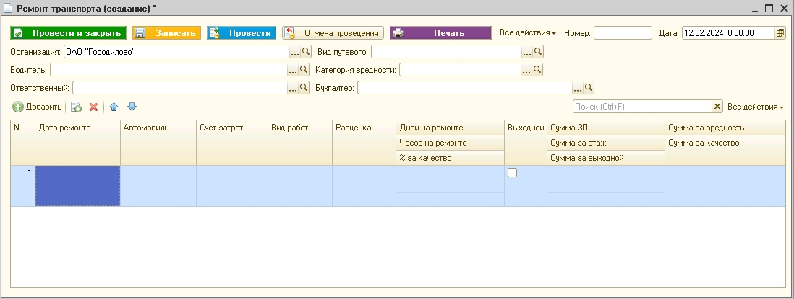

Заполняем документ. Далее нажимаем \"ок\" внизу формы.

Реквизиты для заполнения:

| **Реквизит**      |  **Содержание**                                          |
|:------------------|:---------------------------------------------------------|
| Номер              | Автоматически заполняется номер документа |
| Дата                | Автоматически устанавливается текущая дата, можно изменить при необходимости                    |
| Организация     | Выбирается организация из списка заведенных в программе организаций. При создании документа заполнена первая организация из списка        |
| Группа авто (опц)  | Выбирается папка из справочника ["Транспортные средства"](#--справочник-транспортные-средства). Если выбрать папку, то можно будет по кнопке "заполнить" заполнить таблицу всеми автомобилями из данной папки, иначе придется в табличной части добавлять каждый автомобить через кнопку "Добавить"           |
| Категория дорог (опц)  | Выбирается  из справочника ["Категории дорог"](#--справочник-категории-дорог)|
| Страна (опц)  | Выбирается  из справочника ["Страны"](#--справочник-страны)|
|  **Табличная часть**        |
| N  | Автоматическая нумерация элементов таблицы               |
| Дата ремонта | Выбирается дата               |
| Автомобиль | Выбирается  из справочника ["Транспортные средства"](#--справочник-транспортные-средства)|
| Гос. номер  | Вводится госномер, если в элементе справочника ["Транспортные средства"](#--справочник-транспортные-средства) номер указан, то заполнится автоматически|
| Спидометр | Вводятся начальные показатели спидометра|
| Тахометр  | Вводятся начальные показатели тахометра|

### &bull;  Документ "Путевые листы"

| Назначение  документа  |  Документ предназначен ????????     |
|:-------------------------|:-------------------------------------------------------|
| Путь                     |  Главное меню → Документы → ???????? |

Документ имеет 3 вида: Грузовые, Легковые, Механизаторы

1. Грузовые

Документ выглядит следующим образом:

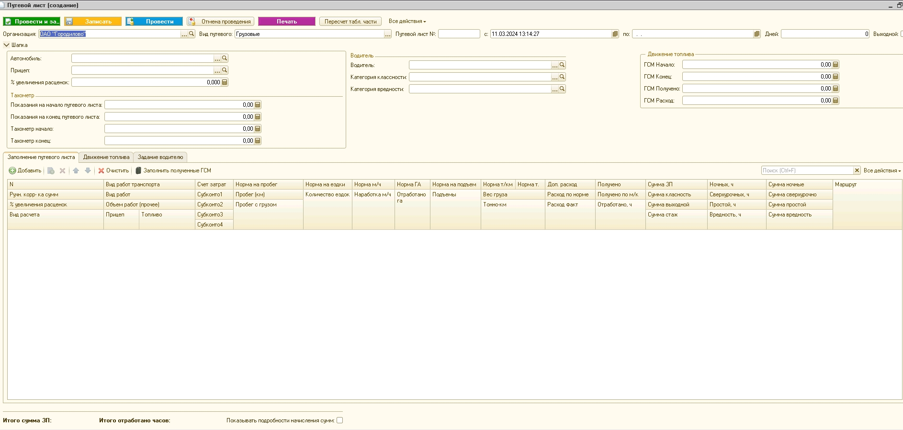

Реквизиты для заполнения:

| **Реквизит**      |  **Содержание**                                          |
|:------------------|:---------------------------------------------------------|
| Организация     | Выбирается организация из списка заведенных в программе организаций         |
| Вид Путевого     | Выбирается вид, от него зависит вид шапки и табличной части         |
| Путевой лист №     | Вводится номер путевого       |
| Дата с       |  Дата начала путевого. Автоматически текущая дата|
| Дата по | Выбирается дата конца путевого     |
| Дней  | Рассчитывается автоматически кол-во дней путевого|
| Флаг "Выходной"  | Отечается, если был выходной день, для расчта ЗП в выходной|
| Автомобиль  | Выбирается из справочника ["Транспортные средства"](#--справочник-транспортные-средства) |
| Прицеп  | Выбирается из справочника ["Транспортные средства"](#--справочник-транспортные-средства). Заполняется автоматически, если выбран в автомобиле|
| Процент увеличения расценок  | |
| Показания на начало путевого листа  | |
| Показания на конец путевого листа  | |
| Тахометр начало  | |
| Тахометр конец  | |
| Водитель  |Выбирается из справочника ["Сотрудники"](#--справочник-сотрудники)|
| Категория классности  |   Выбирается из справочника ["Категории классности"](#--справочник-категории-классности)|
| Категория вредности | Выбирается из справочника ["Категории вредности"](#--справочник-категории-вредности)|
| ГСМ начало | |
| ГСМ конец  | |
| ГСМ получено  | |
| ГСМ расход | |
| Табличная часть "Заполнение путевого листа      |  |
| N  | Автоматическая нумерация элементов таблицы               |
| Ручная корректировка сумм  |            |
| Процент увеличения расценок  |        |
| Вид расчета |  Выбирается из справочника ["Виды расчетов"](#--справочник-виды-расчетов)          |
| Вид работ транспорта  | Выбирается из справочника ["Виды работ транспорта"](#--справочник-виды-работ-транспорта)        |
| Вид работ  | Если табличная часть не заполнена автоматически по кнопке "заполнить" то выбирается из справочника [ "Виды работ"](#--справочник-виды-работ)         |
| Объем работ(прочее) |             |
| Прицеп |          |
| Топливо |             |
| Счет затрат |             |
| Норма на пробег |          |
| Пробег(км) |             |
| Пробег с грузом (!только для вида "Грузовые")|             |
| Норма на ездки |          |
| Кол-во ездок |             |
| Норма м/ч  |             |
| Наработка м/ч |          |
| Норма ГА |             |
| Отработано ГА |             |
| Норма на подъем |             |
| Подъемы |             |
| Норма т/км |          |
| Норма т |             |
| Вес груза |             |
| Тонно-км |             |
| Доп.расход |             |
| Расход по норме |          |
| Расход факт |             |
| Получено |             |
| Получено по м/к |             |
| Сумма зп|     Рассчитывается автоматически?????????          |
| Сумма классность |  Рассчитывается автоматически?????????          |
| Сумма выходной|   Рассчитывается автоматически?????????            |
| Сумма стаж |     Рассчитывается автоматически?????????          |
| Ночных, ч |   Вводится кол-во ночных часов          |
| Сверхурочных, ч |  Вводится кол-во сверхурочных часов             |
| Простой, ч |    Вводится кол-во часов простоя        |
| Вредность, ч |      Вводится кол-во часов за вредность        |
| Сумма ночные |     Рассчитывается автоматически?????????        |
| Сумма сверхурочно |Рассчитывается автоматически?????????               |
| Сумма простой |    Рассчитывается автоматически?????????           |
| Сумма вредность |  Рассчитывается автоматически?????????          |
| Маршрут |             |

2. Легковые

Документ выглядит следующим образом:

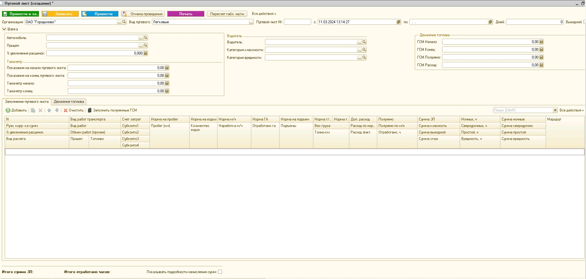

3. Механизаторы

Документ выглядит следующим образом:

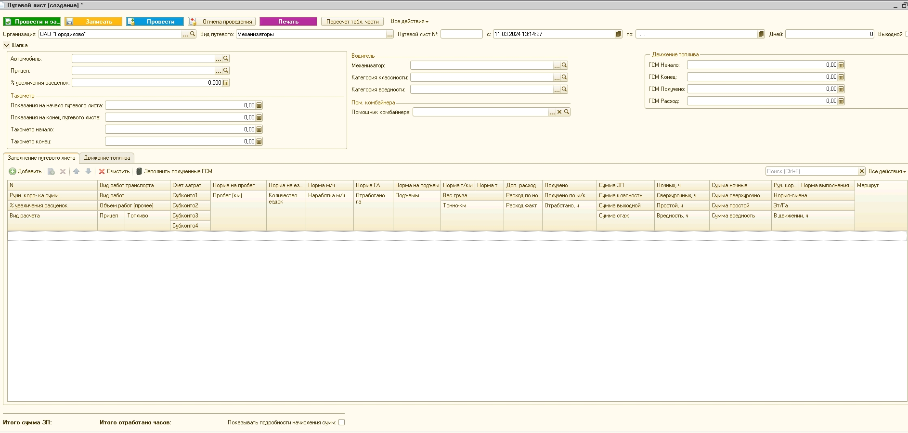

Расчеты:

Итоговая сумма ЗП расчитывается как сумма элементов  "Сумма ЗП", "Сумма класность", "Сумма выходной", "Сумма стаж","Сумма ночные", "Сумма сверхурочно", "Сумма вредность" 

**ЗП_Водителя**

???СуммаЗП_и_СуммаЗПСверхурочно

Сумма простой = кол-во часов * расценка на вид расчета(необходимо указать в [справочнике "Виды расчетов"](#--справочник-виды-расчетов))
Сумма ночные =  кол-во часов * расценка на вид расчета(необходимо указать в [справочнике "Виды расчетов"](#--справочник-виды-расчетов)) * ПроцентНочных(необходимо указать в константах организации) / 100
Сумма вредность = тарифная ставка 1-го разряда(необходимо указать в константах организации) * кол-во часов * ПроцентВредность(откуда, из каких периодических реквизитов?????) / 100

???Сумма класность = ЧасоваяСтавкаРаботыНаТС (ргистр??)
		
		ПроцентКлассности = откуда???

???Сумма стаж  
		
		
		

**ЗП помощника комбайнера**

=СуммаЗППомощникаКомбайнера + СуммаЗП_и_СуммаЗПСверхурочно + СуммаЗаВредность + СуммаЗаКласность + СуммаСтаж

Сумма вредность = тарифная ставка 1-го разряда(необходимо указать в константах организации) * кол-во часов * ПроцентВредность(откуда, из каких периодических реквизитов?????) / 100

ЗначениеЗаполнено(ЧасоваяСтавкаРаботыНаТС) тогда
				СтрТЧ.СуммаЗаКласностьПК = СтрТЧ.ОтработаноЧасов * ЧасоваяСтавкаРаботыНаТС * ПроцентПомКлассности / 100;

СтрТЧ.СуммаЗаКласностьПК = _База * ПроцентПомКлассности((откуда, из каких периодических реквизитов?????)) / 100
   База = 

Учет ГСМ в путевых без ведомостей(нет) - константа

